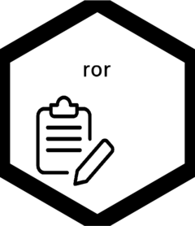

<!-- README.md is generated from README.Rmd. Please edit that file -->

# ror

<!-- badges: start -->

[](https://lifecycle.r-lib.org/articles/stages.html#experimental)


<!-- badges: end -->

`ror4r` is an R wrapper for the [Research Organization Registry
(ROR)](#https://ror.org) API. ROR is a registry of more than 100,000
research organisations across the globe. It holds data on location,
aliases and type of organisation - plus much more.

Currently, the `ror4r` package lets you return a list of organisations
(`get_org_list()`) or details for a specific organisation if you know
its ID (`get_single_org()`) via the API. If you know IDs from other
registries (eg, GRID, UKPRN), you can use `get_id_map()` to lookup other
IDs for the organisation ROR has stored.

You may find the [API
documentation](https://ror.readme.io/docs/rest-api), or the [reference
site](http://shanj90.github.io/ror4r) helpful in using this wrapper. The
[ROR API GitHub repo](https://github.com/ror-community/ror-api) may also
be of use.

In addition to the API interactions, you can also use `read_data_dump()`
to extract a dataframe of all the data from the system.

## Installation

You can install the development version of ror like so:

``` r
remotes::install_github("shanej90/ror4r")
```

## Example

The below example shows you how to return details for a specific
organisation:

``` r
library(ror4r)

data <- get_single_org(id = "03yghzc09") #University of Exeter
#> No encoding supplied: defaulting to UTF-8.

data
#> $id
#> [1] "https://ror.org/03yghzc09"
#> 
#> $name
#> [1] "University of Exeter"
#> 
#> $email_address
#> NULL
#> 
#> $ip_addresses
#> list()
#> 
#> $established
#> [1] 1955
#> 
#> $types
#> [1] "Education"
#> 
#> $relationships
#>                                                       label    type
#> 1                                        Derriford Hospital Related
#> 2               Peninsula College of Medicine and Dentistry Related
#> 3                           Royal Devon and Exeter Hospital Related
#> 4    Wellcome Centre of Cultures and Environments of Health   Child
#> 5 GW4 Facility for High-Resolution Electron Cryo-Microscopy Related
#> 6                                                       GW4 Related
#> 7                           MRC Centre for Medical Mycology   Child
#>                          id
#> 1 https://ror.org/00v5h4y49
#> 2 https://ror.org/04dtfyh05
#> 3 https://ror.org/03jrh3t05
#> 4 https://ror.org/00rbqbc98
#> 5 https://ror.org/022p86748
#> 6 https://ror.org/000vekr11
#> 7 https://ror.org/00vbzva31
#> 
#> $addresses
#>       lat      lng state state_code   city geonames_city.id geonames_city.city
#> 1 50.7236 -3.52751    NA         NA Exeter          2649808             Exeter
#>   geonames_city.geonames_admin1.name geonames_city.geonames_admin1.id
#> 1                            England                          6269131
#>   geonames_city.geonames_admin1.ascii_name geonames_city.geonames_admin1.code
#> 1                                  England                             GB.ENG
#>   geonames_city.geonames_admin2.name geonames_city.geonames_admin2.id
#> 1                              Devon                          2651292
#>   geonames_city.geonames_admin2.ascii_name geonames_city.geonames_admin2.code
#> 1                                    Devon                          GB.ENG.D4
#>                  geonames_city.license.attribution
#> 1 Data from geonames.org under a CC-BY 3.0 license
#>                 geonames_city.license.license geonames_city.nuts_level1.name
#> 1 http://creativecommons.org/licenses/by/3.0/                             NA
#>   geonames_city.nuts_level1.code geonames_city.nuts_level2.name
#> 1                             NA                             NA
#>   geonames_city.nuts_level2.code geonames_city.nuts_level3.name
#> 1                             NA                             NA
#>   geonames_city.nuts_level3.code postcode primary line country_geonames_id
#> 1                             NA       NA   FALSE   NA             2635167
#> 
#> $links
#> [1] "http://www.exeter.ac.uk/"
#> 
#> $aliases
#> list()
#> 
#> $acronyms
#> list()
#> 
#> $status
#> [1] "active"
#> 
#> $wikipedia_url
#> [1] "http://en.wikipedia.org/wiki/University_of_Exeter"
#> 
#> $labels
#>                label iso639
#> 1 Prifysgol Caerwysg     cy
#> 
#> $country
#> $country$country_name
#> [1] "United Kingdom"
#> 
#> $country$country_code
#> [1] "GB"
#> 
#> 
#> $external_ids
#> $external_ids$ISNI
#> $external_ids$ISNI$preferred
#> NULL
#> 
#> $external_ids$ISNI$all
#> [1] "0000 0004 1936 8024"
#> 
#> 
#> $external_ids$FundRef
#> $external_ids$FundRef$preferred
#> [1] "501100000737"
#> 
#> $external_ids$FundRef$all
#> [1] "501100000737" "501100000604"
#> 
#> 
#> $external_ids$HESA
#> $external_ids$HESA$preferred
#> NULL
#> 
#> $external_ids$HESA$all
#> [1] "0119"
#> 
#> 
#> $external_ids$UCAS
#> $external_ids$UCAS$preferred
#> NULL
#> 
#> $external_ids$UCAS$all
#> [1] "E84"
#> 
#> 
#> $external_ids$UKPRN
#> $external_ids$UKPRN$preferred
#> NULL
#> 
#> $external_ids$UKPRN$all
#> [1] "10007792"
#> 
#> 
#> $external_ids$OrgRef
#> $external_ids$OrgRef$preferred
#> NULL
#> 
#> $external_ids$OrgRef$all
#> [1] "33719893"
#> 
#> 
#> $external_ids$Wikidata
#> $external_ids$Wikidata$preferred
#> NULL
#> 
#> $external_ids$Wikidata$all
#> [1] "Q1414861"
#> 
#> 
#> $external_ids$GRID
#> $external_ids$GRID$preferred
#> [1] "grid.8391.3"
#> 
#> $external_ids$GRID$all
#> [1] "grid.8391.3"
```

## Future developments

At the moment, the package purely makes calls to the API and returns the
data in an appropriate format. Future plans for the package will further
process the data to meet specific goals. At the moment you’ll need to do
this outside of the package using your own understanding of the data.

Feel free to fork if you’d like to have a go yourself.

## Logo attribution

Icon from [www.flaticon.com](https://www.flaticon.com).
